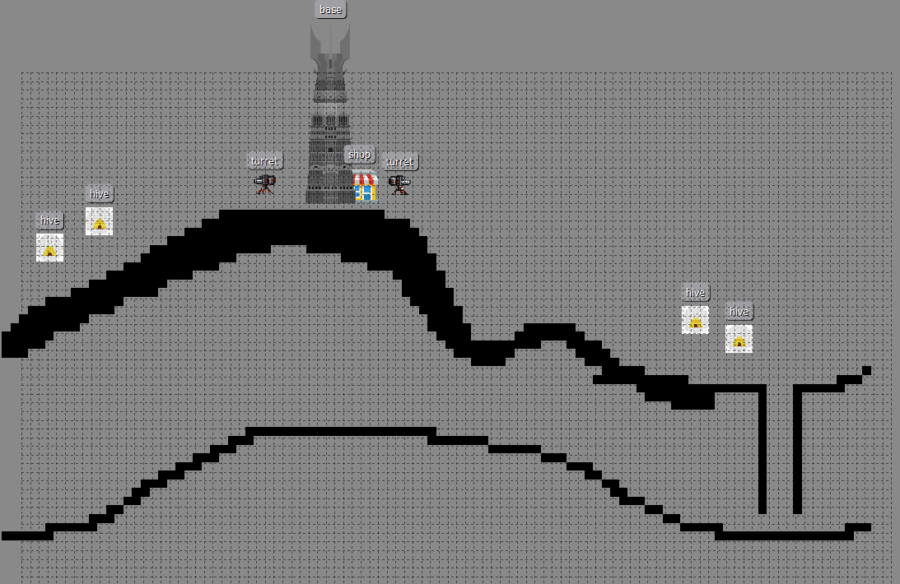
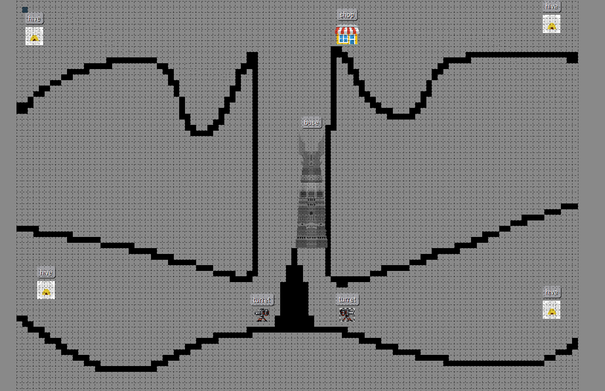

# Patch Notes

## PRÓXIMAMENTE

- Más mapas
- Algo más de dificultad
- Leaderboards
- Comprar e invocar estructuras defensivas
- Sistema de combate más elaborado
- Más elementos en el menú (configuración, créditos, etc.)
- Tesoros escondidos y aleatorios en algunos mapas

## 09/26/2017

- Defender a la abuela

  - La abuela está preparando su delicioso gumbo, conocido en todo el Bajou
  - Cuando un enemigo entra en contacto con la abuela, ésta recibirá daño
  - Si la abuela muere, se acabará la partida

- Cambios en los mapas: ya que los enemigos pueden trepar, los mapas se pueden diseñar poniendo muros totalmente verticales entre la base y el punto de spawn de los enemigos

- Rework de SMG:

  - El jugador puede disparar un número de balas seguidas (10 de momento)
  - Cuando dispara las balas disponibles, debe recargar para poder disparar de nuevo
  - De momento, se recarga LEVANTANDO el click izquierdo (dejar pulsado para disparar, levantar para recargar)

- Con la escopeta, también hay que levantar el click izquierdo para recargar (ya no se puede dejar pulsado y disparar continuamente)

- Límite en la máxima velocidad de caída de los personajes (rozamiento con el aire). Así de paso se arreglan los bugs en los que no se detectaba la colisión con el suelo al caer muy rápido y lo atravesaban.

- Los objetos con los que se puede interactuar (cofres de momento) muestran la tecla que has de pulsar para cogerlos

- Nivel 5: no spoiler, pásalo bien :D

## 09/25/2017

<!-- - Efectos chulos: activar -->

 - Optimización menor del rendering

  - Los bots escalan las paredes al entrar en contacto con ellas
  - Mejorado el movimiento de la cámara en el modo sniper
  - El nivel inicial (firstLevel) se almacena en localStorage (se guarda entre distintas partidas)

## 09/24/2017

- Flecha ligada al héroe que apunta hacia el cursor
- Persistencia de datos: los datos persistentes se guardan localmente en tu navegador y se cargan cada vez que vuelves a abrir el juego

  - Nombre: cambia tu nombre en la GUI (Open Controls arriba a la derecha o ESCAPE in game)

- Breve inmunidad durante backflip y frontflip

- Las armas se pueden elegir también con los números

  - {1}: Shotgun
  - {2}: SMG
  - {3}: Sniper rifle

- Delay entre cambio de armas: 0.5 segundos para poder disparar tras cambiar de arma

- Desactiva el arma al hacer un frontflip/backflip (exactamente igual que al cambiar de arma)

- Sniper mode: YEAH BITCH! (work in progress)

  - Mantener click izquierdo pulsado y arrastrar el ratón para mover la cámara
  - {S} para fijar la cámara
  - Soltar para disparar. Al soltar, si dejaste pulsado SHIFT, la cámara sigue a la bala

## 09/23/2017

- Shopkeeper
- Controles en el menú de pausa
- Nuevo tileset para los mapas
- Los enemigos voladores y el boss atacan lanzando proyectiles
- Barra de vida provisional
- Bug fixes varios
- Buf a la escopeta:

  - Las balas salen más compactas
  - Las balas son más rápidas
  - Cooldown reducido

- Nerf al rifle de francotirador

  - 3.5 segundos de CD (+ 1.5)

- Ajustada la hitbox del personaje principal al cuerpo del sprite

- Desviación de las balas de la escopeta aleatoria

- Pequeña desviación para las balas de la metralleta

- Coger objetos

  - Hay objetos que no se recogen automáticamente al pasar por encima
  - Estos objetos se indican con un halo amarillo alrededor
  - Para cogerlos, pulsa la tecla F

- Los esbirros enemigos tienen una probabilidad de soltar un tesoro

## 09/22/2017

- Más datos de debug (tiempo de ejecución de las fases del update)
- Aspect ratio 16:9

  - El tamaño inicial es HD (1280x720)
  - Al escalar la ventana en la que se encuentra el juego, éste se escala pero manteniendo el aspect rotation
  - F11 para pantalla completa... SUCH HD

- Diseño de la HUD responsive

- Escopeta

  - El disparo simple que había antes ha sido sustituido por uno estilo escopeta
  - 5 balas
  - 750ms de cooldown
  - Sonido realista al disparar

- Transiciones de la cámara al cambiar de pantalla

- Flash rojo al recibir daño

- Sniper

  - Un disparo de 150 de daño
  - Al dejar el click izquierdo pulsado, te muestra la trayectoria que seguirá

- Cambiar de arma usando la rueda del ratón. Ahora, para cambiar el objeto de la tienda, hay que mantener pulsado SHIFT al gira la rueda del ratón.

- Hardcore mode en el menú de pausa: activa/desactiva la violencia del juego

- Cooldowns distintos para las armas (puedes ver el tiempo restante para poder volver a disparar en la HUD a la izquierda)

- Machine gun

  - Arma de fuego automática (dejar pulsado para disparar)

## 09/21/2017

- Mejoras menores en la colisión física entre grupos
- Rework del sistema de combate (en progreso)

## 09/20/2017

- Enlace a patchnotes.pdf desde el menú del juego
- Mejoras menores de rendimiento en la IA
- Harry el sucio! xD spritesheet con animaciones para el personaje principal

  - Quieto
  - Saltar (una ñapa porque no hay animación de saltar en el spritesheet)
  - Andar
  - Andar con la pistola (si apuntas en el arco de 180º hacia adelante)

## 09/19/2017

- Nuevo tipo de enemigo: boss

  - El boss tiene más vida que el resto de enemigos
  - Al morir, deja caer una recompensa mejor que la de los otros enemigos
  - TODO: ataques del boss chulos

- Interfaz con dat.GUI!

  - Modo slow-mo (?)
  - Modo debug: permite ver los FPS, el focus de tus esbirros, etc. Próximamente más cosas
  - Reiniciar el juego (volver a empezar desde el primer nivel)
  - Volver al menú
  - Ir a la pantalla de Game Over (para debug)
  - Elegir cuál será el primer nivel (para debug)
  - Cambiar el nombre de usuario

- Shake shake shake cuando el héroe recibe daño

- Una vez el héroe reciba daño, no podrá volver a recibir daño hasta 1.5 segundos más tarde

- El héroe sólo puede disparar y lanzar granadas en un arco de 180º hacia delante (no disparará si apuntas hacia atrás)

- Nuevo objeto disponible en la tienda: Coraçao

  - Restaura 50 puntos de salud por $25

- En la pantalla de Game Over, se puede volver al menú o volver a jugar haciendo click en los textos

  - ~~Contenido secreto~~

## 09/18/2017

- Editor de mapas funcionando  
- Nuevo input: Gamepad XBOX360 (todavía en fase de prueba, parcialmente soportado)

  - Para cambiar de input, hacer click en el icono del teclado/gamepad que aparece en el menú

- Pausa in-game

  - Con gamepad, se pausa con start pero hay que despausar con el ESCAPE del teclado. Gracias Valve. Digo... Phaser

- Mejoras de torreta hasta nivel 5 (Empieza al nivel 1)

## 09/17/2017

- Bug fixes

  - El perrete ha sido reemplazado por un zombie grande
  - Mejoras en la IA

- Nuevo mapa: al llegar al máximo número de oleadas en un mapa, cambia al siguiente (cola circular)

- Nuevo sistema de mapas: Mapas creados con la herramienta Tiled incoming

- Menú simple: click en el botón para empezar a jugar

- La escopeta apunta (más o menos) hacia donde está el ratón

- Menú: click en "Change Map" para cambiar al siguiente mapa

## 09/16/2017

- Modo endless: matar enemigos en el mismo mapa por OLEADAS incrementando gradualmente la dificultad

  - Las tumbas, el dinero y las granadas se conservan entre rondas

- Mostrar la puntuación obtenida al morir

- Nuevo objeto: MEJORAR TORRETA

  - Mejora tu torreta comprando este objeto en la tienda

- Los bots ya no colisionan con la torreta

## 09/15/2017

- Dinero que se puede gastar en la tienda
- Tienda

  - Comprar granadas
  - Comprar piñas
  - Estar cerca de la tienda para comprar y ver los objetos

- Comprar objeto actual -> tecla P

- Cambiar al siguiente objeto de la tienda -> tecla N

- Varias granadas activas a la vez

- Los enemigos sueltan dinero que el jugador puede recoger

- Sonido al comprar objeto

- Nuevo objeto: PERRO

- SHIFT + Q/E: tus perros hacen trucos :D

- Scroll con la rueda del ratón para cambiar el objeto seleccionado en la tienda

- Click con la rueda para comprar el objeto seleccionado

## 09/14/2017

- Frontflip and backflip
- Extra points for killing an enemy while performing a front/backflip PROTIP: SHIFT + right click -> frontflip/backflip (Q/E)
- Grenades

## 09/07/2017

- Principio de la creación
